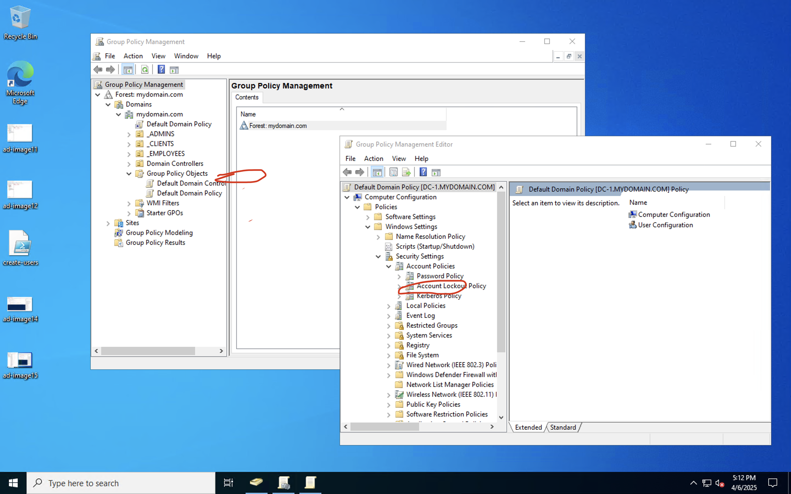
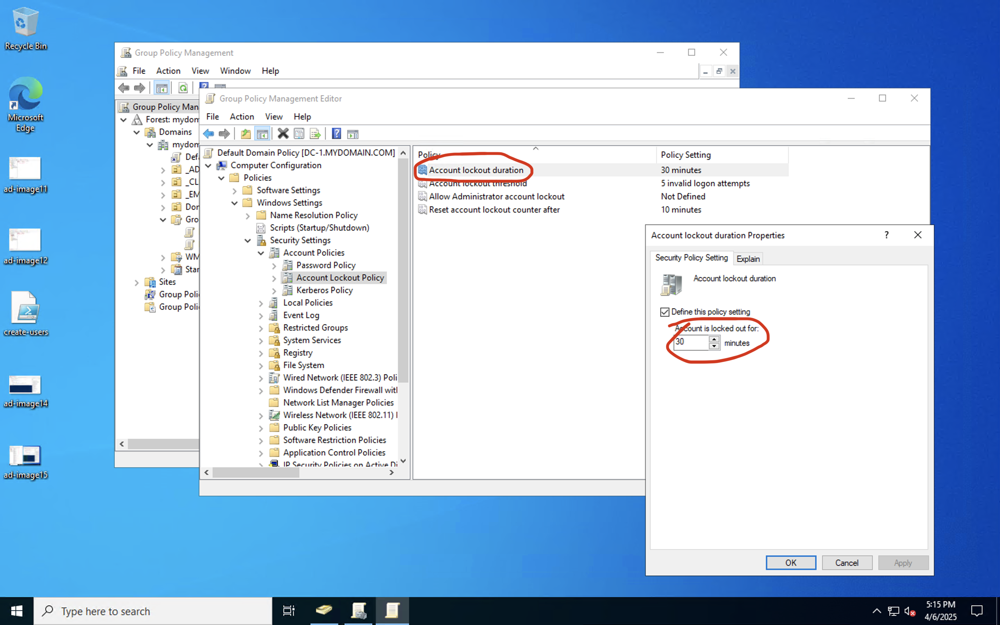
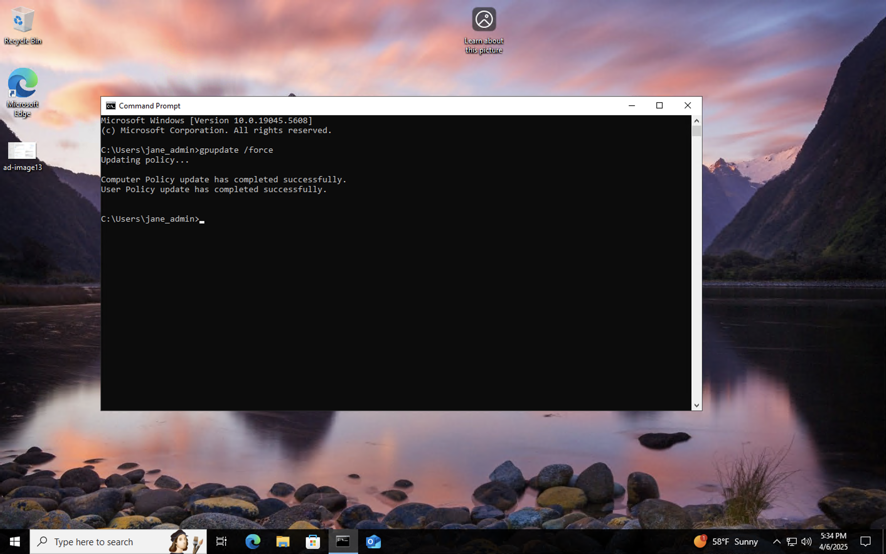
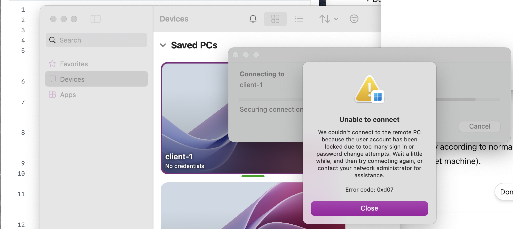
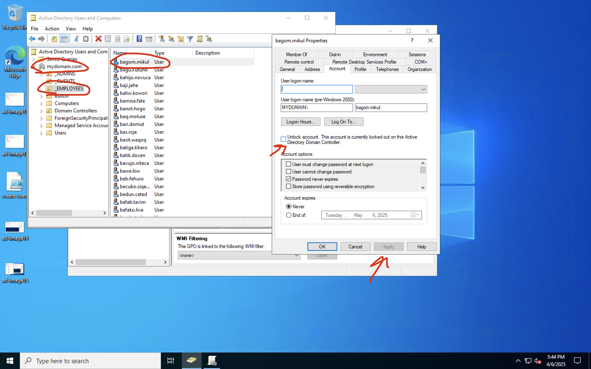

# configure-ad

<h1>On-premises Active Directory Deployed in the Cloud (Azure)</h1>
This tutorial outlines the implementation of on-premises Active Directory within Azure Virtual Machines. 

<h2>Environments and Technologies Used</h2>

- Microsoft Azure (Virtual Machines/Compute)
- Remote Desktop
- Active Directory Domain Services
- PowerShell

<h2>Operating Systems Used </h2>

- Windows Server 2022
- Windows 10 (21H2)

<h2>High-Level Deployment and Configuration Steps</h2>

- Step1: Create VM for Domain controller(DC) and client-1. 
- Step 2: Configure DC private IP address to static, set client-1 DNS setting to DC private IP address
- Step 3: Install Active Directory, create Domain, configure for Domain admin and users.
- Step 4: Setup remote desktop for non-admin users on client-1 and attempt connections.

<h2>Virtual Machine Prerequisets</h2>
- Make sure both VM are in same virtual network not default network
- Both in the same region (more efficient)
- Make sure one has a server image for operating system, this will be DC-1

 
<h2>Deployment and Configuration Steps</h2>

  <strong>SETTING A GROUP POLICY</strong> 
  To configure the account lockout policy via Group Policy, open the Group Policy Management Console (GPMC) on the <strong>dc-1</strong> VM. 
  Right-click the <strong>Start</strong> button → click <strong>Run</strong> → type <code>gpmc.msc</code> → press <strong>Enter</strong>. 

  In the GPMC, right-click your domain (e.g., <strong>mydomain.com</strong>) and select <strong>Edit</strong>. 
  Navigate to: <strong>Computer Configuration → Policies → Windows Settings → Security Settings → Account Policies → Account Lockout Policy</strong>. 

  Once there, configure the following settings:

<ul>
  <li><strong>Account lockout duration:</strong> 30 minutes</li>
  <li><strong>Account lockout threshold:</strong> 5 invalid login attempts</li>
  <li><strong>Reset account lockout counter after:</strong> 10 minutes</li>
</ul>
  

  Now, for the new settings to apply, you can either wait for Group Policy to propagate automatically or force an update immediately. 
  On a client machine, open <strong>Command Prompt</strong> and run: <code>gpupdate /force</code>, then press <strong>Enter</strong>. 
  In this case, log in to the <strong>client-1</strong> VM as the admin account: <code>mydomain.com\jane_admin</code>.

  To verify that the Group Policy is in place, log out of the admin account and attempt to sign in as a regular user. 
  Intentionally enter the wrong password <strong>five times</strong> — for example, I used <code>mydomain.com\bagom.mikul</code> with an incorrect password. 
  After the fifth failed attempt, the account was locked, confirming that the Group Policy is working as expected.

  Now we can unlock the account. On the <strong>dc-1</strong> VM, open <strong>Active Directory Users and Computers</strong>. 
  Navigate to: <strong>mydomain.com → _EMPLOYEES</strong>, then right-click and select <strong>Find</strong>. 
  Type the locked-out username (e.g., <code>bagom.mikul</code>), double-click the account, and check <strong>Unlock Account</strong>. 
  The user <code>bagom.mikul</code> is now unlocked.  

  To reset the password for this account, right-click the user in <strong>Active Directory Users and Computers</strong> and select <strong>Reset Password...</strong>

