# configure-ad

<h1>On-premises Active Directory Deployed in the Cloud (Azure)</h1>
This tutorial outlines the implementation of on-premises Active Directory within Azure Virtual Machines. 

<h2>Environments and Technologies Used</h2>

- Microsoft Azure (Virtual Machines/Compute)
- Remote Desktop
- Active Directory Domain Services
- PowerShell

<h2>Operating Systems Used </h2>

- Windows Server 2022
- Windows 10 (21H2)

<h2>High-Level Deployment and Configuration Steps</h2>

- Step1: Create VM for Domain controller(DC) and client-1. 
- Step 2: Configure DC private IP address to static, set client-1 DNS setting to DC private IP address
- Step 3: Install Active Directory, create Domain, configure for Domain admin and users.
- Step 4: Setup remote desktop for non-admin users on client-1 and attempt connections.

<h2>Virtual Machine Prerequisites</h2>
<ul>
  <li>Make sure both VMs are in the same virtual network (not the default network)</li>
  <li>Both should be in the same region (more efficient)</li>
  <li>Ensure one VM uses a server image for the operating system, this will be <strong>DC-1</strong></li>
</ul>

 
<h2>Deployment and Configuration Steps</h2>

  After creating the virtual machines, we need to set <strong>DC-1</strong>'s IP address to <strong>static</strong> to ensure it doesn’t change. 
  To do this, go to the Azure portal → click <strong>Virtual Machines</strong> → select <strong>DC-1</strong> → navigate to <strong>Network settings → IP configurations</strong> → click on <strong>ipconfig1</strong> → set the IP assignment to <strong>Static</strong>.  

  <strong>Note:</strong> For this setup to work smoothly during testing, make sure to disable the Microsoft Firewall by logging into <strong>DC-1</strong> and turning it off.

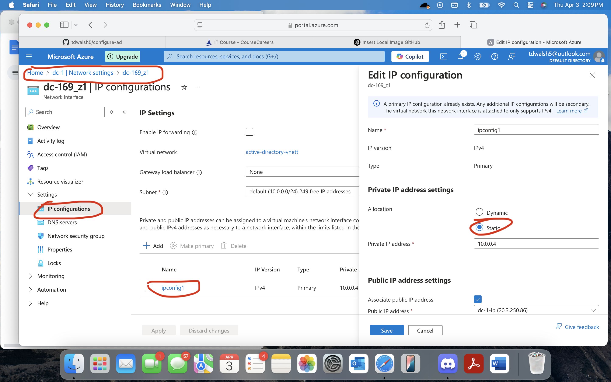

  

  To change the DNS server for <strong>client-1</strong>, go to the <strong>Virtual Machines</strong> section in the Azure portal and select <strong>client-1</strong>. 
  From there, navigate to: <strong>Network settings → DNS servers</strong> (under the <em>Settings</em> menu) → choose <strong>Custom</strong> → enter the private IP address of <strong>DC-1</strong>. 
  This change will reroute DNS traffic to <strong>DC-1</strong> instead of the default Azure gateway.

  To confirm the DNS configuration, log in to <strong>client-1</strong> and run the following PowerShell commands: 
  <code>ipconfig /all</code> 
  <code>ping 10.0.0.4</code> 
  These will verify the DNS settings and confirm network connectivity to <strong>DC-1</strong>.

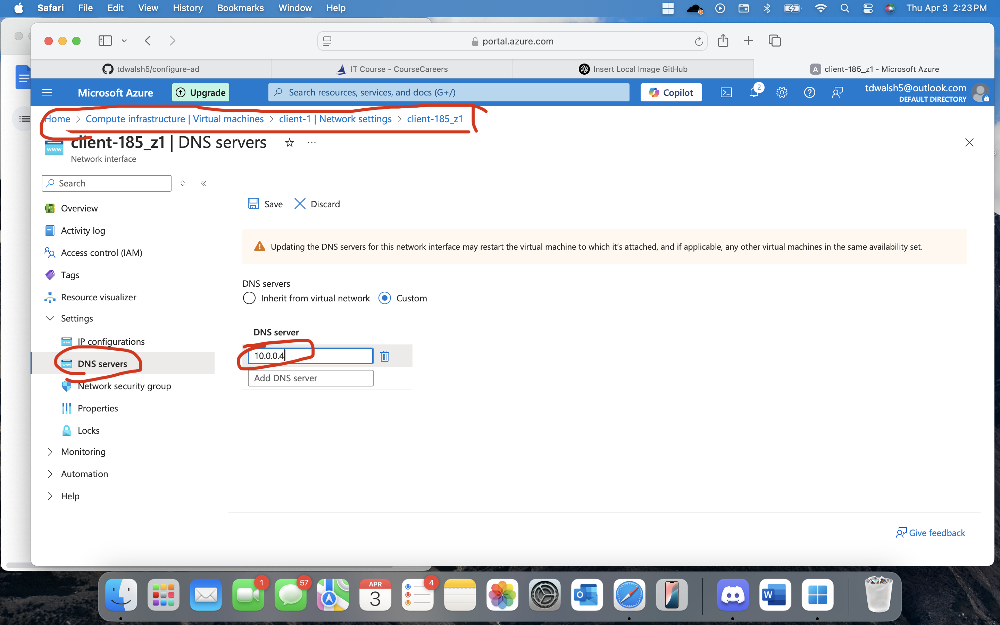

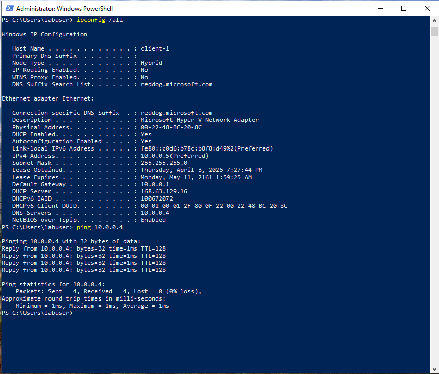

  

  To make <strong>DC-1</strong> a domain controller, open <strong>Server Manager</strong> and click on <strong>Add Roles and Features</strong>. 
  Click <strong>Next</strong> through the prompts until you reach the <strong>Server Roles</strong> page (as shown in the first image). 
  Select <strong>Active Directory Domain Services</strong>, then continue clicking <strong>Next</strong> until you reach the <strong>Install</strong> option.  

  Once installation is complete, click the flag icon in the upper-right corner of Server Manager (as shown in image two). 
  Select <strong>Promote this server to a domain controller</strong>, then choose <strong>Deployment Configuration → Add a new forest</strong>, and enter your desired root domain name. 
  Continue through the wizard and complete the installation.  

  After installation, the VM will automatically restart. When logging back in, use your domain credentials. 
  For example, to log in as user <strong>labuser</strong> within the domain <strong>mydomain.com</strong>, enter: <code>mydomain.com\labuser</code>.

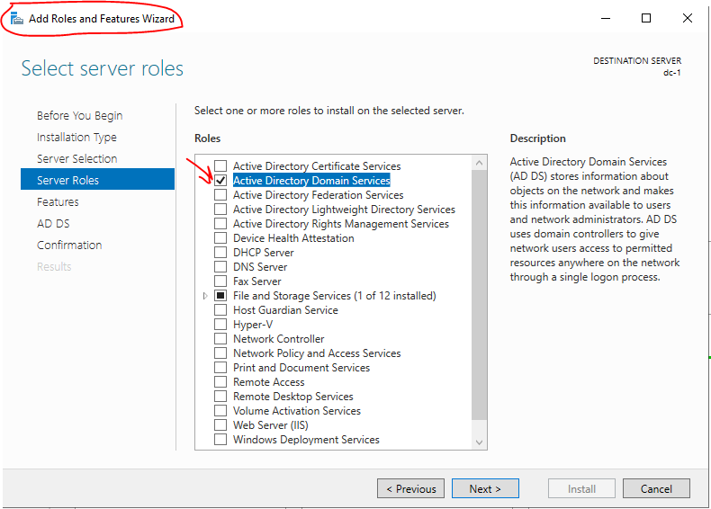

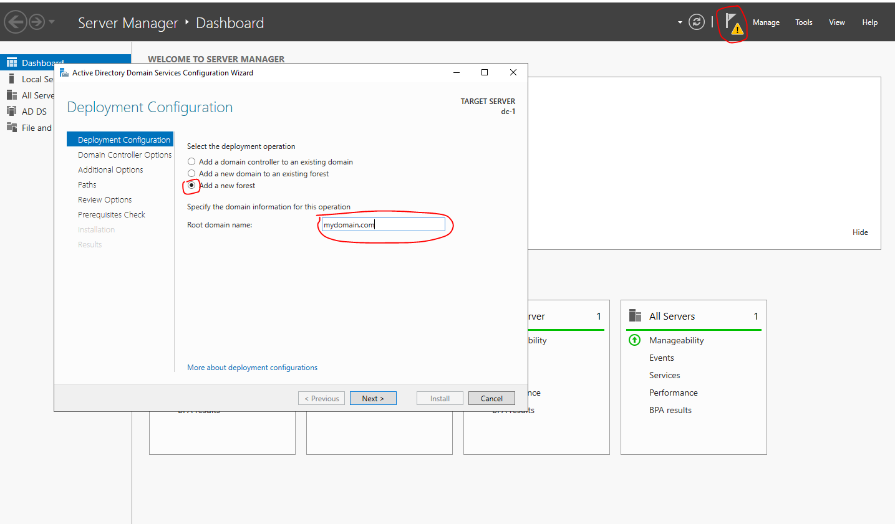

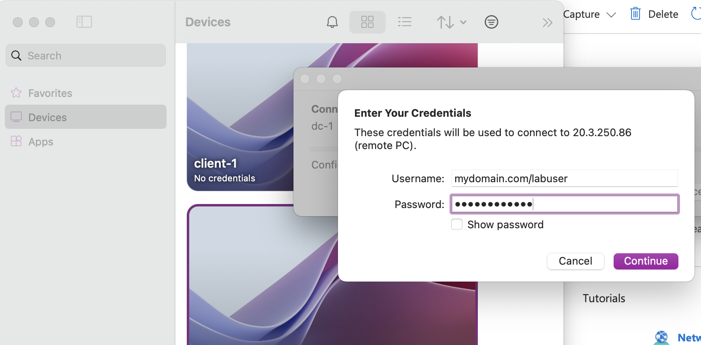

  

  Now we want to create two folders—one for employees and another for admins—and also create a Domain Admin user.  

  To create the folders, click the search bar and type <strong>Active Directory Users and Computers</strong>, then open it. 
  Right-click on <strong>mydomain.com</strong> → select <strong>New → Organizational Unit</strong> → enter the folder names. 
  In this case, create two organizational units: <strong>_EMPLOYEES</strong> and <strong>_ADMINS</strong>.  

  To create a Domain Admin user: 
  Right-click the <strong>_ADMINS</strong> folder → select <strong>New → User</strong> → fill out the user details. 
  For this example, we create a user named <strong>jane_admin</strong>. Click <strong>Next</strong>, then set a password when prompted.  

  Once the user is created, right-click on <strong>jane_admin</strong> → select <strong>Properties</strong> → go to the <strong>Member Of</strong> tab → click <strong>Add</strong> → type <code>Domain Admins</code> → click <strong>Check Names</strong> → then <strong>OK</strong>, <strong>Apply</strong>, and <strong>OK</strong> again.

  Jane_admin is now officially part of the <strong>Domain Admins</strong> group.

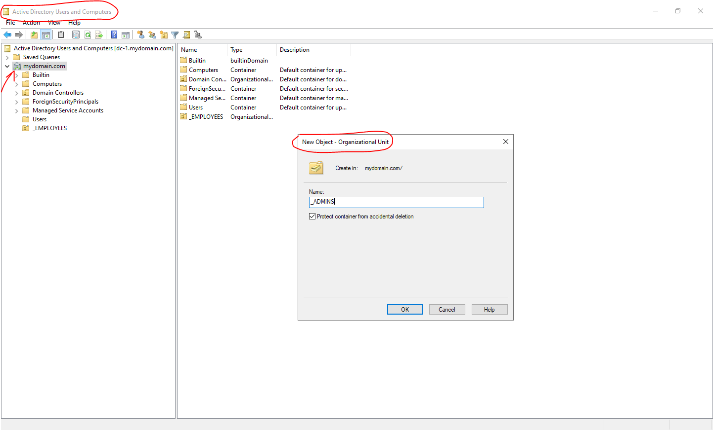

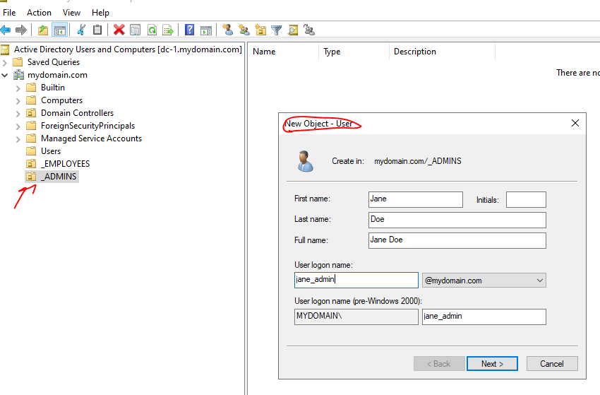

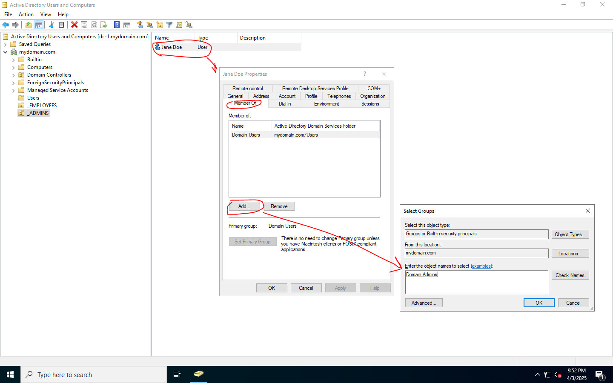

  

  The next step is to add <strong>Client-1</strong> to our domain. 
  Log in to the client-1 VM using your initial user account (in this case, <code>labuser</code>). 
  Go to <strong>Settings → Rename this PC (advanced)</strong> → click <strong>Change</strong> → select <strong>Domain</strong> and enter your domain name (e.g., <code>mydomain.com</code>) → click <strong>OK</strong>.

  This process adds <strong>Client-1</strong> to the domain <strong>mydomain.com</strong>. 
  To confirm the change, go back to the Domain Controller VM. 
  Open <strong>Active Directory Users and Computers</strong> → click on the <strong>Computers</strong> folder → you should see <strong>Client-1</strong> listed there.

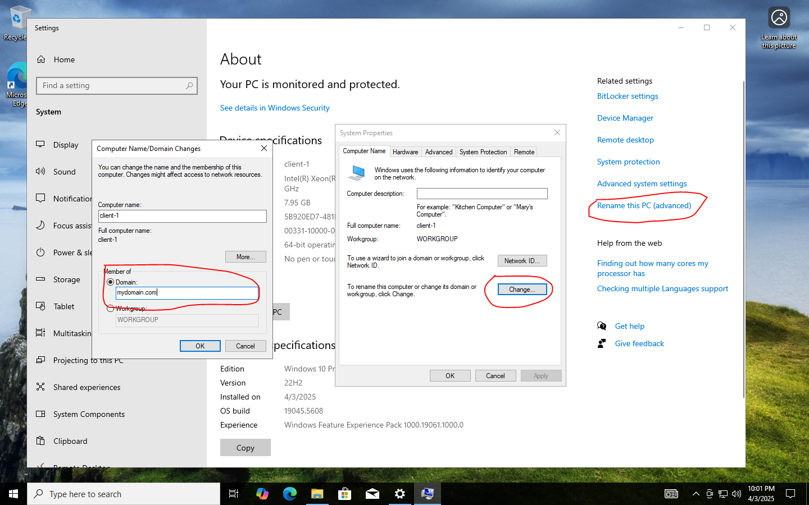

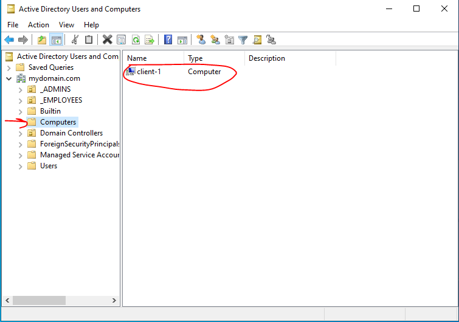

  

  In this step, we want to grant remote access to <strong>Client-1</strong> for all users in the domain. 
  Log in to <strong>Client-1</strong> as the admin user (e.g., <code>jane_admin</code>). 
  Go to <strong>Settings → Remote Desktop</strong> (found on the right side of the page) → click <strong>Select users that can remotely access this PC</strong> → click <strong>Add</strong> and enter <strong>Domain Users</strong> → click <strong>OK</strong>.  

  This grants remote desktop access to all domain users. You can now create additional user accounts that will be able to connect to <strong>Client-1</strong> remotely.

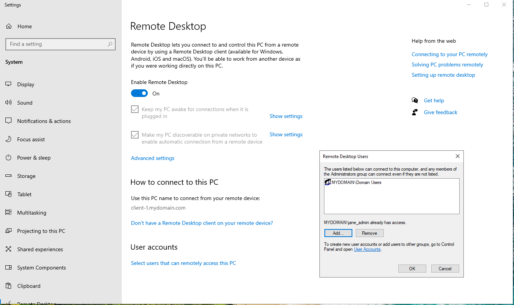

  

  To create users in bulk, we can use a PowerShell script. Here's how to do it:  

  Log in to <strong>DC-1</strong> as an admin (mydomain.com\jane_admin) → open <strong>PowerShell ISE</strong> → go to <strong>File → New</strong> → paste the script into the editor → click <strong>Run Script</strong>.  

  If executed correctly, the script will generate user accounts. To confirm, open <strong>Active Directory Users and Computers</strong> and navigate to the <strong>_EMPLOYEES</strong> folder — the new accounts should appear there.  

  <strong>Note:</strong> In this example, the script creates <strong>10000 user accounts</strong>, all using the password <code>Password1</code>. The users will be imported into the <strong>_EMPLOYEES</strong> organizational unit, so it's important that this folder exists and is named correctly.  

  Finally, to verify that the accounts work, try logging into <strong>Client-1</strong> via <strong>Remote Desktop</strong> using one of the new users. For example: 
  <strong>Username:</strong> <code>mydomain.com\bagom.mikul</code> 
  <strong>Password:</strong> <code>Password1</code>

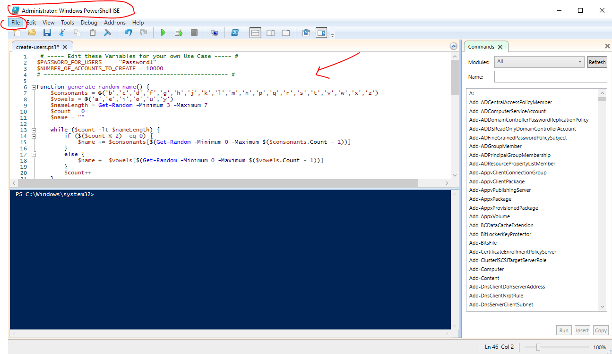

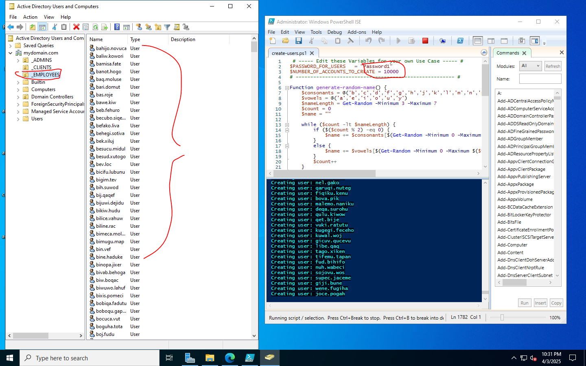

  

  <h2>SETTING A GROUP POLICY</h2> 
  To configure the account lockout policy via Group Policy, open the Group Policy Management Console (GPMC) on the <strong>dc-1</strong> VM. 
  Right-click the <strong>Start</strong> button → click <strong>Run</strong> → type <code>gpmc.msc</code> → press <strong>Enter</strong>. 

  In the GPMC, right-click your domain (e.g., <strong>mydomain.com</strong>) and select <strong>Edit</strong>. 
  Navigate to: <strong>Computer Configuration → Policies → Windows Settings → Security Settings → Account Policies → Account Lockout Policy</strong>. 

  Once there, configure the following settings:

<ul>
  <li><strong>Account lockout duration:</strong> 30 minutes</li>
  <li><strong>Account lockout threshold:</strong> 5 invalid login attempts</li>
  <li><strong>Reset account lockout counter after:</strong> 10 minutes</li>
</ul>
  

  Now, for the new settings to apply, you can either wait for Group Policy to propagate automatically or force an update immediately. 
  On a client machine, open <strong>Command Prompt</strong> and run: <code>gpupdate /force</code>, then press <strong>Enter</strong>. 
  In this case, log in to the <strong>client-1</strong> VM as the admin account: <code>mydomain.com\jane_admin</code>.

  To verify that the Group Policy is in place, log out of the admin account and attempt to sign in as a regular user. 
  Intentionally enter the wrong password <strong>five times</strong> — for example, I used <code>mydomain.com\bagom.mikul</code> with an incorrect password. 
  After the fifth failed attempt, the account was locked, confirming that the Group Policy is working as expected.

  Now we can unlock the account. On the <strong>dc-1</strong> VM, open <strong>Active Directory Users and Computers</strong>. 
  Navigate to: <strong>mydomain.com → _EMPLOYEES</strong>, then right-click and select <strong>Find</strong>. 
  Type the locked-out username (e.g., <code>bagom.mikul</code>), double-click the account, and check <strong>Unlock Account</strong>. 
  The user <code>bagom.mikul</code> is now unlocked.  

  To reset the password for this account, right-click the user in <strong>Active Directory Users and Computers</strong> and select <strong>Reset Password...</strong>

